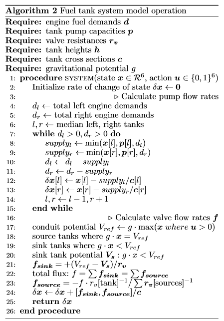

# Appendix

Ahmed, I., Quiñones-Grueiro, M. and Biswas, G. (2020). Fault-Tolerant Control of Degrading Systems with On-Policy Reinforcement Learning. IFAC-PapersOnLine.

## System operation

The fuel tank system operates under the following algorithm. The code for this can be found in the [source](./tanks.py).

## System parameters

* Gravitational potential /ms^-2 **g** = 10.
* Tank heights /m **h** = 1 for all tanks.
* Tank cross sections /m^2 **c** = 1 for all tanks.
* Valve resistances / m^-1s^-1 **r_v** = 100 for all valves,
* Pump capacities /m^3 s^-1 **p** = 0.1 for all pumps.
* Engine demands /m^3 s^-1 **e** = 0.025 for all engines

## Hyperparameter search

Hyperparameter grid search for the fuel tanks model was conducted over the following grid:

Architecture: (32, 32), (32, 32, 32), (64,64), (128, 128), (256, 256), (512, 512)}
Learning rate: 10^-2, 5 * 10^-3, 10^-3
Activation: ReLU, tanh

Models had 12 inputs and 6 outputs corresponding to the mapping `x_t x u_t --> x_{t+1}`. Evaluation was based on average metrics of 3 fold cross validation on 2950 samples. The mean coefficient of determination over the 6 outputs was used as the evaluation metric. All other model parameters (optimizer, batch size) were kept at defaults as specified in the Scikit-Learn MLPRegressor class.

The reinforcement learning agent using the PPO algorithm was implemented using the Stable-Baselines library. It had the following parameters:

* Learning rate 10^(-2)
* Update interval t_update = 128
* Architecture: A shared policy and value network. First two layers of 64 units are shared. Then two branches each of two layers of 16 units each. tanh activation is used throughout.